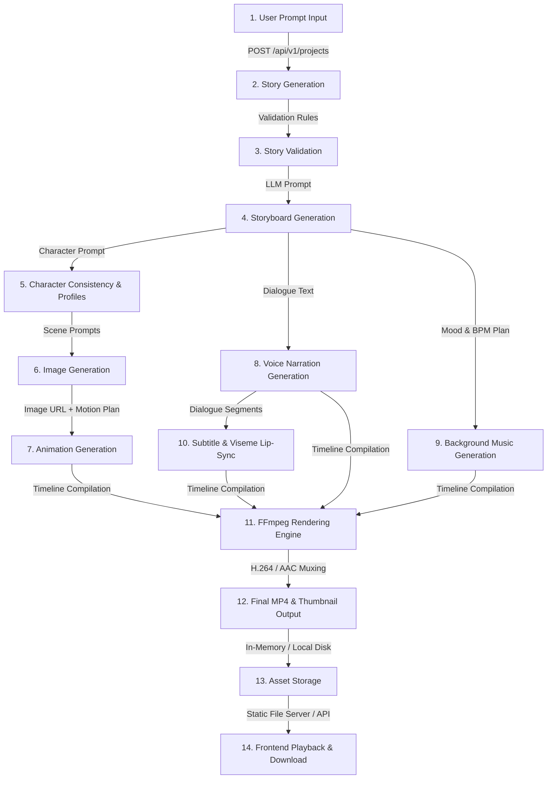

# KidsAI Studio Real Pipeline Status

## Executive Summary

This document presents a comprehensive, empirical end-to-end audit of the KidsAI Studio v2.0 pipeline. The primary objective is to evaluate the codebase's ability to generate **ONE REAL 30-60 second educational video** from a single text prompt using real API integrations and local processing engines.

### Key Audit Findings:
1. **Mock Provider Dominance**: All AI provider wrapper classes (`LLMProvider`, `ImageProvider`, `AnimationProvider`, `VoiceProvider`, `MusicProvider`) default to mock implementations that return hardcoded text, placeholder image URLs (`https://placehold.co/...`), or sample video URLs (`https://commondatastorage.googleapis.com/.../ForBiggerBlazes.mp4`).
2. **In-Memory State Storage**: Data model state throughout the entire pipeline is persisted in Python in-memory dictionaries (`app/core/db.py`) rather than an active database (Supabase/PostgreSQL) or object storage (Cloudflare R2/S3).
3. **Real Provider Runtime Deficiencies**:
   - **LLM (`app/core/llm.py`)**: `KimiLLMProvider` targets `https://api.moonshot.cn/v1/chat/completions`. If `OPENAI_API_KEY` is provided with standard OpenAI credentials (`sk-...`), calls fail and silently fall back to `MockLLMProvider`.
   - **Image Generation (`app/core/image_provider.py`)**: `FluxImageProvider` checks `REPLICATE_API_KEY` (whereas `.env.example` specifies `FLUX_API_KEY`). Replicate's `/v1/predictions` endpoint is asynchronous; because no polling logic or `Prefer: wait` header exists, `output` is initially `None`, causing immediate fallback to `placehold.co` image URLs.
   - **Animation Generation (`app/core/animation_provider.py`)**: `Wan2AnimationProvider` suffers from the exact same asynchronous prediction response handling issue, falling back to a hardcoded Google Cloud sample MP4 URL.
   - **Voice Narration (`app/core/voice_provider.py`)**: `KokoroTTSProvider` calls ElevenLabs API (`api.elevenlabs.io`), but discards the returned MP3 audio stream and hardcodes `storage_url` to a sample video URL (`TearsOfSteel.mp4`).
   - **Music Generation (`app/core/music_provider.py`)**: `StableAudioProvider` targets Stability AI's image core endpoint (`https://api.stability.ai/v2beta/stable-image/generate/core`), failing and falling back to a sample video URL.
4. **Rendering & FFmpeg Execution Failure**:
   - `FFmpegRenderService` filters out any media URLs starting with `"http"`, setting `image_path` and `narration_path` to `None`. This forces FFmpeg to generate solid blue placeholder slides instead of actual images/audio.
   - `FFmpegEngine` fails during execution because `ffmpeg` CLI binary is not installed on the system `PATH`.
5. **Frontend UI Disconnection**: The Next.js frontend wizard creates draft projects, but does not expose or trigger the backend `POST /api/v1/projects/{project_id}/generate-full-pipeline` endpoint, nor does it bind rendered MP4 files to an active video player component.

---

## End-to-End Pipeline Diagram



---

## Component-by-Component Audit

| Stage | File | Provider | Status | API Key | Real/Mock | Output | Next Consumer | Blocker |
| :--- | :--- | :--- | :--- | :--- | :--- | :--- | :--- | :--- |
| **1. User Prompt** | `apps/frontend/src/app/projects/new/page.tsx` & `apps/backend/app/api/v1/projects.py` | FastAPI `create_project` | Functional | None | Real | JSON Project payload | Stage 2 (Story Gen) | None |
| **2. Story Generation** | `apps/backend/app/services/director.py` & `app/services/story.py` & `app/core/llm.py` | `MockLLMProvider` / `KimiLLMProvider` | Fallback active | `KIMI_API_KEY` / `OPENAI_API_KEY` | Mock default | JSON `production_plan` & `story_script` | Stage 3 (Story Validation) & Stage 4 | Moonshot endpoint mismatch with OpenAI key |
| **3. Story Validation** | `apps/backend/app/services/validator.py` | `ValidationService` (Python) | Functional | None | Real | Validated dict + `_warnings` list | Stage 4 (Storyboard Gen) | None |
| **4. Storyboard Generation** | `apps/backend/app/services/storyboard.py` & `app/core/llm.py` | `MockLLMProvider` / `KimiLLMProvider` | Fallback active | `KIMI_API_KEY` | Mock default | JSON `storyboard` with 4 scenes | Stage 5, 6, 7, 8, 9 | Moonshot endpoint mismatch |
| **5. Character Consistency** | `apps/backend/app/services/character.py` | `CharacterEngineService` | Partial | None | Placeholder | List of `CharacterProfile` objects | Stage 6 (Image Gen) | Reference image URL is `placehold.co` |
| **6. Image Generation** | `apps/backend/app/services/image_generator.py` & `app/core/image_provider.py` | `MockImageProvider` / `FluxImageProvider` | Incomplete / Fallback | `REPLICATE_API_KEY` | Mock default | List of `GeneratedImage` objects | Stage 7 & Stage 11 | Replicate async polling missing; HTTP URL rejected by FFmpeg |
| **7. Animation Generation** | `apps/backend/app/services/animation_generator.py` & `app/core/animation_provider.py` | `MockAnimationProvider` / `Wan2AnimationProvider` | Incomplete / Fallback | `REPLICATE_API_KEY` | Mock default | List of `AnimatedSceneClip` objects | Stage 11 (FFmpeg Render) | Replicate async polling missing; HTTP URL rejected by FFmpeg |
| **8. Voice Generation** | `apps/backend/app/services/voice_service.py` & `app/core/voice_provider.py` | `MockVoiceProvider` / `KokoroTTSProvider` | Incomplete / Discarded | `ELEVENLABS_API_KEY` | Mock default | List of `VoiceNarrationAsset` objects | Stage 10 & Stage 11 | Audio stream discarded; hardcodes sample video URL |
| **9. Music Generation** | `apps/backend/app/services/music_service.py` & `app/core/music_provider.py` | `MockMusicProvider` / `StableAudioProvider` | Broken / Fallback | `STABLE_AUDIO_API_KEY` | Mock default | List of `MixedAudioTrack` objects | Stage 11 (FFmpeg Render) | Stability AI image endpoint called instead of audio endpoint |
| **10. Subtitle / Lip-Sync** | `apps/backend/app/services/lip_sync.py` & `app/services/rendering/subtitles.py` | `LipSyncEngineService` & `SubtitleEngine` | Functional | None | Real | `LipSyncMetadata` & `.ass` file | Stage 11 (FFmpeg Render) | None |
| **11. FFmpeg Rendering** | `apps/backend/app/services/ffmpeg_renderer.py` & `app/services/rendering/renderer.py` | `FFmpegRenderer` & `FFmpegEngine` | Failing | None | Real | `/tmp/kidsai_renders/{id}/final.mp4` | Stage 12 & Stage 14 | Missing system `ffmpeg` binary; ignores HTTP URLs |
| **12. Final MP4 Output** | `apps/backend/app/services/rendering/renderer.py` | FFmpeg H.264/AAC Muxer | Failing | None | Real | 1080p MP4 & thumbnail.jpg | Stage 13 & Stage 14 | Blocked by Stage 11 failure |
| **13. Asset Storage** | `apps/backend/app/core/db.py` | In-memory dicts (`renders_db`, etc.) | Volatile | `SUPABASE_KEY`, `R2_BUCKET_URL` | Mock | Memory dict + local `/tmp` disk | Stage 14 (Frontend) | Server restart wipes all generated assets |
| **14. Frontend Playback** | `apps/frontend/src/app/projects/[id]/page.tsx` & `lib/api.ts` | Next.js / React | Disconnected | None | Real | Browser UI rendering | End User | No button triggers full pipeline; player not bound to output |

---

## Detailed Stage Analysis

### Stage 1: User Prompt
- **File**: `apps/frontend/src/app/projects/new/page.tsx`, `apps/backend/app/api/v1/projects.py`
- **Class/Function**: `CreateProjectWizardPage`, `create_project`
- **API Endpoint**: `POST /api/v1/projects`
- **Provider/Model**: FastAPI Request Validator
- **Required Env Vars**: `NEXT_PUBLIC_API_URL`
- **Status**: REAL
- **Input Format**: Form JSON (`title`, `prompt`, `target_age_group`, `language`, `video_length`, `aspect_ratio`, `video_style`, `voice`)
- **Output Format**: `Project` object
- **Where Stored**: In-memory `projects_db` dictionary
- **Next Stage Consumer**: Stage 2 (Director / Story Service)
- **Error Handling**: Form validation errors returned via `APIResponse(success=False, error=...)`
- **Test**: `tests/test_api.py::test_create_project_and_get`
- **Test Proof**: Real in-memory CRUD test

### Stage 2: Story Generation
- **File**: `apps/backend/app/services/director.py`, `app/services/story.py`, `app/core/llm.py`
- **Class/Function**: `DirectorAgentService.generate_production_plan`, `StoryAgentService.generate_story_script`, `LLMProvider`
- **API Endpoint**: `POST /api/v1/projects/{id}/generate-plan`, `POST /api/v1/projects/{id}/generate-story`
- **Provider/Model**: `MockLLMProvider` by default; `KimiLLMProvider` (`moonshot-v1-8k`) when key set
- **Required Env Vars**: `KIMI_API_KEY` (or `OPENAI_API_KEY`)
- **Status**: MOCK by default. Real provider is incomplete (hardcoded Moonshot URL prevents standard OpenAI/Gemini keys from working).
- **Input Format**: Rendered prompt markdown string (`packages/prompts/director.md`, `story.md`)
- **Output Format**: JSON dict containing `production_plan` and `story_script`
- **Where Stored**: In-memory `plans_db` and `stories_db`
- **Next Stage Consumer**: Stage 3 (Story Validator) and Stage 4 (Storyboard)
- **Error Handling**: 3 retries on validation failure or LLM exception; falls back to mock provider inside `KimiLLMProvider` on HTTP error.
- **Test**: `tests/test_director_story.py::test_generate_story_script`
- **Test Proof**: Mocks real LLM provider (executes against `MockLLMProvider`)

### Stage 3: Story Validation
- **File**: `apps/backend/app/services/validator.py`
- **Class/Function**: `ValidationService.validate_production_plan`, `ValidationService.validate_story_script`
- **API Endpoint**: Synchronously executed during Stage 2 endpoints
- **Provider/Model**: Python rule-based validation logic
- **Required Env Vars**: None
- **Status**: REAL
- **Input Format**: JSON dict (`raw_plan`, `raw_story`)
- **Output Format**: List of warning strings or raises `QualityValidationError`
- **Where Stored**: Mutates dictionary in place (`raw_plan["_warnings"]`)
- **Next Stage Consumer**: Stage 4 (Storyboard)
- **Error Handling**: Raises `QualityValidationError` to trigger retry loop
- **Test**: `tests/test_director_story.py`
- **Test Proof**: Real rule-based logic test

### Stage 4: Storyboard Generation
- **File**: `apps/backend/app/services/storyboard.py`, `app/core/llm.py`
- **Class/Function**: `StoryboardAgentService.generate_storyboard`
- **API Endpoint**: `POST /api/v1/projects/{id}/generate-storyboard`
- **Provider/Model**: `MockLLMProvider` / `KimiLLMProvider`
- **Required Env Vars**: `KIMI_API_KEY`
- **Status**: MOCK by default
- **Input Format**: `story_script_json`, `production_plan_json`
- **Output Format**: JSON Storyboard structure (scenes with visual plan, camera plan, character refs)
- **Where Stored**: In-memory `storyboards_db`
- **Next Stage Consumer**: Stages 5, 6, 7, 8, 9, 10, 11
- **Error Handling**: 3 retries on `StoryboardValidationError`
- **Test**: `tests/test_storyboard.py`
- **Test Proof**: Mocks real LLM provider

### Stage 5: Character Generation / Consistency
- **File**: `apps/backend/app/services/character.py`
- **Class/Function**: `CharacterEngineService.extract_and_generate_profiles`
- **API Endpoint**: `POST /api/v1/projects/{id}/characters/generate`
- **Provider/Model**: Text prompt loader (`packages/prompts/character.md`) + static URL template
- **Required Env Vars**: None
- **Status**: PLACEHOLDER
- **Input Format**: Story characters list
- **Output Format**: List of `CharacterProfile` domain objects
- **Where Stored**: In-memory `characters_db`
- **Next Stage Consumer**: Stage 6 (Image generation prompt composer) & Stage 7 (Animation planner)
- **Error Handling**: Simple loop, no retries
- **Test**: `tests/test_character_image.py`
- **Test Proof**: Proves placeholder creation only

### Stage 6: Image Generation
- **File**: `apps/backend/app/services/image_generator.py`, `app/core/image_provider.py`
- **Class/Function**: `ImagePipelineService.generate_all_scene_images`, `FluxImageProvider.generate_image`
- **API Endpoint**: `POST /api/v1/projects/{id}/images/generate`
- **Provider/Model**: `MockImageProvider` (default); `FluxImageProvider` (`black-forest-labs/flux-schnell` via Replicate)
- **Required Env Vars**: `REPLICATE_API_KEY` (env template specifies `FLUX_API_KEY`)
- **Status**: MOCK default / INCOMPLETE real provider (no async prediction polling, returns `placehold.co` URLs)
- **Input Format**: Storyboard scene visual plan + Character profiles
- **Output Format**: List of `GeneratedImage` objects containing `storage_url`
- **Where Stored**: In-memory `images_db`
- **Next Stage Consumer**: Stage 7 (Animation Generation) and Stage 11 (FFmpeg rendering)
- **Error Handling**: Catches exception and falls back to `MockImageProvider`
- **Test**: `tests/test_character_image.py`, `tests/test_ai_pipeline.py`
- **Test Proof**: Mocks real API call (tests only `MockImageProvider`)

### Stage 7: Animation Generation
- **File**: `apps/backend/app/services/animation_generator.py`, `app/core/animation_provider.py`
- **Class/Function**: `AnimationPipelineService.generate_all_scene_animations`, `Wan2AnimationProvider.generate_animation_clip`
- **API Endpoint**: `POST /api/v1/projects/{id}/animations/generate`
- **Provider/Model**: `MockAnimationProvider` (default); `Wan2AnimationProvider` (`wan-video/wan-2.1-1.3b` via Replicate)
- **Required Env Vars**: `REPLICATE_API_KEY` (env template specifies `WAN_API_KEY`)
- **Status**: MOCK default / INCOMPLETE real provider (no async prediction polling, returns Google Cloud sample MP4 URL)
- **Input Format**: Image URL + Motion prompt
- **Output Format**: List of `AnimatedSceneClip` objects containing `storage_url`
- **Where Stored**: In-memory `animations_db`
- **Next Stage Consumer**: Stage 11 (FFmpeg rendering)
- **Error Handling**: Catches exception and falls back to `MockAnimationProvider`
- **Test**: `tests/test_animation.py`, `tests/test_ai_pipeline.py`
- **Test Proof**: Mocks real API call (tests only `MockAnimationProvider`)

### Stage 8: Voice Generation
- **File**: `apps/backend/app/services/voice_service.py`, `app/core/voice_provider.py`
- **Class/Function**: `VoicePipelineService.generate_all_scene_voices`, `KokoroTTSProvider.synthesize_speech`
- **API Endpoint**: `POST /api/v1/projects/{id}/audio/generate-voices`
- **Provider/Model**: `MockVoiceProvider` (default); `KokoroTTSProvider` (calls ElevenLabs API `api.elevenlabs.io`)
- **Required Env Vars**: `ELEVENLABS_API_KEY`
- **Status**: MOCK default / INCOMPLETE real provider (discards returned audio bytes; hardcodes `TearsOfSteel.mp4` as `storage_url`)
- **Input Format**: Dialogue text string + Voice parameters
- **Output Format**: List of `VoiceNarrationAsset` objects
- **Where Stored**: In-memory `audios_db`
- **Next Stage Consumer**: Stage 10 (Lip-sync visemes) and Stage 11 (FFmpeg rendering)
- **Error Handling**: Catches exception and falls back to `MockVoiceProvider`
- **Test**: `tests/test_audio.py`, `tests/test_ai_pipeline.py`
- **Test Proof**: Mocks real API call (tests only `MockVoiceProvider`)

### Stage 9: Music Generation
- **File**: `apps/backend/app/services/music_service.py`, `app/core/music_provider.py`
- **Class/Function**: `MusicPipelineService.generate_all_scene_music_mixes`, `StableAudioProvider.synthesize_music_and_mix`
- **API Endpoint**: `POST /api/v1/projects/{id}/music/generate`
- **Provider/Model**: `MockMusicProvider` (default); `StableAudioProvider` (wrong endpoint: calls Stability AI image endpoint)
- **Required Env Vars**: `STABLE_AUDIO_API_KEY`
- **Status**: BROKEN real provider / MOCK default
- **Input Format**: Music prompt string, duration, BPM
- **Output Format**: List of `MixedAudioTrack` objects
- **Where Stored**: In-memory `music_mixes_db`
- **Next Stage Consumer**: Stage 11 (FFmpeg rendering)
- **Error Handling**: Catches exception and falls back to `MockMusicProvider`
- **Test**: `tests/test_music.py`, `tests/test_ai_pipeline.py`
- **Test Proof**: Mocks real API call (tests only `MockMusicProvider`)

### Stage 10: Subtitle / Lip-Sync Generation
- **File**: `apps/backend/app/services/lip_sync.py`, `app/services/rendering/subtitles.py`
- **Class/Function**: `LipSyncEngineService.generate_lip_sync_timeline`, `SubtitleEngine`
- **API Endpoint**: Synchronously executed during Stage 8 & Stage 11
- **Provider/Model**: Heuristic Viseme / ASS Subtitle Generator
- **Required Env Vars**: None
- **Status**: REAL rule-based engine
- **Input Format**: List of `DialogueSegment` items
- **Output Format**: `LipSyncMetadata` viseme timeline & `.ass` subtitle file
- **Where Stored**: In-memory `audios_db` + temporary `.ass` file during rendering
- **Next Stage Consumer**: Stage 11 (FFmpeg rendering subtitle burn-in)
- **Error Handling**: Standard Python exception handling
- **Test**: `tests/test_audio.py`, `tests/test_ffmpeg_rendering_engine.py`
- **Test Proof**: Real heuristic execution test

### Stage 11: FFmpeg Rendering
- **File**: `apps/backend/app/services/ffmpeg_renderer.py`, `app/services/rendering/renderer.py`, `app/services/rendering/ffmpeg.py`
- **Class/Function**: `FFmpegRenderService.render_video`, `FFmpegRenderer.render`, `FFmpegEngine.run_command`
- **API Endpoint**: `POST /api/v1/projects/{id}/render/generate`, `POST /api/v1/projects/{id}/generate-full-pipeline`
- **Provider/Model**: Local system FFmpeg CLI binary
- **Required Env Vars**: System `PATH` containing `ffmpeg`
- **Status**: FAILING (FFmpeg binary missing on host system; logic ignores HTTP media URLs)
- **Input Format**: `VideoTimeline` model with scene list
- **Output Format**: Local `/tmp/kidsai_renders/{project_id}/final.mp4` and `thumbnail.jpg`
- **Where Stored**: Local disk `/tmp/kidsai_renders/{id}/` + in-memory `renders_db`
- **Next Stage Consumer**: Stage 12, 13, 14
- **Error Handling**: Fallbacks for xfade transitions and subtitle overlay; returns status `"FAILED"` on environment or render error.
- **Test**: `tests/test_ffmpeg_rendering_engine.py`, `tests/test_rendering.py`, `tests/test_ai_pipeline.py`
- **Test Proof**: FAILING in current environment due to missing `ffmpeg` CLI binary.

### Stage 12: Final MP4 Output
- **File**: `apps/backend/app/services/rendering/renderer.py`, `apps/backend/app/main.py`
- **Class/Function**: `FFmpegRenderer.render`, StaticFiles mount `/static/renders`
- **API Endpoint**: `GET /static/renders/{project_id}/final.mp4`
- **Provider/Model**: FFmpeg H.264 / AAC Muxer
- **Required Env Vars**: None
- **Status**: FAILING (Blocked by Stage 11 execution failure)
- **Input Format**: Subtitled video track + mixed audio track
- **Output Format**: 1080p 24fps H.264 / AAC MP4 file & JPEG thumbnail
- **Where Stored**: `/tmp/kidsai_renders/{project_id}/final.mp4`
- **Next Stage Consumer**: Stage 13 & Stage 14
- **Error Handling**: Sets `status = "FAILED"` and `file_size_bytes = 0` if output file absent
- **Test**: `tests/test_ffmpeg_rendering_engine.py`
- **Test Proof**: FAILING due to missing `ffmpeg` binary

### Stage 13: Asset Storage
- **File**: `apps/backend/app/core/db.py`, `apps/backend/app/core/config.py`
- **Class/Function**: In-memory repository dicts (`projects_db`, `renders_db`, etc.)
- **API Endpoint**: `GET /api/v1/projects/{id}`
- **Provider/Model**: Python in-memory dictionaries
- **Required Env Vars**: `SUPABASE_URL`, `SUPABASE_KEY`, `R2_BUCKET_URL` (currently unused in runtime code)
- **Status**: MOCK / VOLATILE (No active Supabase or Cloudflare R2 bucket uploader implemented)
- **Input Format**: Python model objects / file paths
- **Output Format**: HTTP URLs (`http://localhost:8000/static/renders/...`)
- **Where Stored**: Python Process RAM
- **Next Stage Consumer**: Stage 14 (Frontend)
- **Error Handling**: None (State lost on process restart)
- **Test**: `tests/test_api.py`
- **Test Proof**: Tests in-memory state retention only

### Stage 14: Frontend Playback & Download
- **File**: `apps/frontend/src/app/projects/[id]/page.tsx`, `apps/frontend/src/lib/api.ts`
- **Class/Function**: `ProjectDetailsPage`
- **API Endpoint**: `GET /api/v1/projects/{id}/render/tasks`
- **Provider/Model**: HTML5 Video Player / Next.js React UI
- **Required Env Vars**: `NEXT_PUBLIC_API_URL`
- **Status**: DISCONNECTED (No UI control to trigger `POST /generate-full-pipeline` or `/render/generate`; video player component not bound to `final_video_url`)
- **Input Format**: JSON render task payload from backend API
- **Output Format**: Rendered DOM elements
- **Where Stored**: Client browser DOM state
- **Next Stage Consumer**: End User
- **Error Handling**: Console error logging
- **Test**: None
- **Test Proof**: N/A

---

## Environment Variables Required

Below is the classification of all environment variables identified across `.env.example`, `app/core/config.py`, and provider modules:

### 1. Required for Today's Test (Minimum Real Pipeline):
- `REPLICATE_API_KEY`: Required for real image generation (FLUX Schnell) and video animation (Wan 2.2) via Replicate API.
- `ELEVENLABS_API_KEY`: Required for real voice narration synthesis via ElevenLabs TTS API.
- `OPENAI_API_KEY` or `GEMINI_API_KEY`: Required for real LLM story script & storyboard generation.

### 2. Required for Full Production:
- `SUPABASE_URL`: Required for persistent database & authentication.
- `SUPABASE_SERVICE_ROLE_KEY`: Required for backend database administration.
- `R2_BUCKET`: Cloudflare R2 bucket name for persistent asset hosting.
- `R2_ACCESS_KEY_ID`: Cloudflare R2 credentials.
- `R2_SECRET_ACCESS_KEY`: Cloudflare R2 credentials.
- `R2_ENDPOINT_URL`: Cloudflare R2 storage endpoint.
- `STRIPE_SECRET_KEY`: Billing & subscription system.
- `STRIPE_WEBHOOK_SECRET`: Billing webhook verification.
- `REDIS_URL`: Background task queue (Celery/Arq) state.

### 3. Optional:
- `STABLE_AUDIO_API_KEY`: For optional AI background music generation.
- `KIMI_API_KEY`: Alternative LLM provider (Moonshot AI).

### 4. Local / No-Key Alternatives:
- `FFMPEG_PATH`: Local system FFmpeg binary executable (or system PATH installation).
- `LOCAL_MEDIA_CACHE_DIR`: Directory for caching downloaded HTTP images/audios for local FFmpeg rendering (default: `/tmp/kidsai_renders`).

---

## First Blocking Issue

### **The SINGLE Most Important Blocker:**
**Missing system `ffmpeg` executable on host environment combined with FFmpeg Renderer's inability to process remote HTTP URLs.**

#### Why this is the primary blocker:
1. Even if all AI API keys (`REPLICATE_API_KEY`, `ELEVENLABS_API_KEY`, `OPENAI_API_KEY`) are valid and real media assets are generated, `FFmpegRenderService` checks `if sc.animation_url and not sc.animation_url.startswith("http")`. Any URL starting with `http` is converted to `image_path = None` and `narration_path = None`.
2. As a result, FFmpeg receives no input image/video or narration files and attempts to render fallback solid blue slides with silent audio.
3. Finally, when `FFmpegEngine.get_ffmpeg_path()` is called, it fails immediately with `FFmpegNotFoundError` because `ffmpeg` is not installed on the system PATH. This causes the final video render job to return `status: "FAILED"`, preventing the pipeline from producing a single playable `.mp4` video file.

---

## Recommended Fix Order

Ranked strictly by dependency order to achieve ONE real 30-60 second video:

1. **Install / Provide System FFmpeg Binary**: Ensure `ffmpeg` binary is accessible on system `PATH` so `FFmpegEngine.get_ffmpeg_path()` succeeds.
2. **Implement Local Media Asset Downloader**: Add a helper in `app/services/ffmpeg_renderer.py` that downloads remote HTTP image/video (`storage_url`), voice audio, and music URLs to local disk files in `/tmp/kidsai_renders/{project_id}/assets/` before feeding local file paths into `FFmpegRenderer`.
3. **Fix Replicate Asynchronous Prediction Polling**: Update `FluxImageProvider` (`app/core/image_provider.py`) and `Wan2AnimationProvider` (`app/core/animation_provider.py`) to poll Replicate prediction status (`/v1/predictions/{id}`) or pass header `Prefer: wait` so real generated image/video URLs are returned instead of falling back to mock placeholders. Map environment variable names (`FLUX_API_KEY` / `WAN_API_KEY` -> `REPLICATE_API_KEY`).
4. **Fix ElevenLabs Voice Provider Audio Persistence**: Update `KokoroTTSProvider` (`app/core/voice_provider.py`) to save returned raw MP3 bytes from ElevenLabs API to local disk (`/tmp/kidsai_renders/{project_id}/voice_scene_X.mp3`) and set `storage_url` to the local file path / served static URL instead of hardcoding `TearsOfSteel.mp4`.
5. **Fix LLM Provider OpenAI/Gemini Router**: Update `get_llm_provider` (`app/core/llm.py`) to support direct OpenAI (`https://api.openai.com/v1/chat/completions`) or Gemini API when `OPENAI_API_KEY` or `GEMINI_API_KEY` is present.
6. **Connect Frontend Full Pipeline Generation & Video Player**:
   - Add a "Generate Full Video" action button in `apps/frontend/src/app/projects/[id]/page.tsx` that calls `POST /api/v1/projects/{project_id}/generate-full-pipeline`.
   - Update the Render tab UI in `apps/frontend/src/app/projects/[id]/page.tsx` to mount an HTML5 `<video controls src={renderTask.final_video_url} />` player and a Download button.

---

## Today's Acceptance Test

To prove that the pipeline successfully generates ONE REAL 30-60 second video, the following end-to-end acceptance test must pass:

### Test Definition: `test_real_end_to_end_30s_video_generation`
1. **Trigger**:
   - Send `POST /api/v1/projects` with payload:
     ```json
     {
       "title": "Real 30s Pipeline Test",
       "prompt": "A friendly red panda named Penny learns to count three golden apples in a colorful autumn forest.",
       "target_age_group": "3-5",
       "video_length": "Short (30-60s)",
       "aspect_ratio": "16:9",
       "video_style": "3D Pixar Render"
     }
     ```
2. **Execute Full Pipeline**:
   - Call `POST /api/v1/projects/{project_id}/generate-full-pipeline`.
3. **Assertions**:
   - Response HTTP status code is `200 OK` with `success: true`.
   - `data.status` is `"COMPLETED"`.
   - `data.final_video_url` points to an accessible MP4 file URL.
   - Physical output file exists on disk (e.g. `/tmp/kidsai_renders/{project_id}/final.mp4`) with size > 1MB.
   - Running `ffprobe` on the output MP4 verifies:
     - **Video Stream**: Codec `h264`, Resolution `1280x720` or `1920x1080`, Duration between `30.0` and `60.0` seconds.
     - **Audio Stream**: Codec `aac`, Sample Rate `44100` Hz, Channels `2`.
     - **Visual Content**: Video frames contain real generated imagery (not solid blue fallback canvas text).
     - **Audio Content**: Audio track contains synthesized spoken narration and background music (not silence).
4. **Playback Verification**:
   - HTTP `GET` request to `final_video_url` returns `200 OK` with header `Content-Type: video/mp4`.
   - Frontend video player successfully loads and plays the MP4 file in browser.
